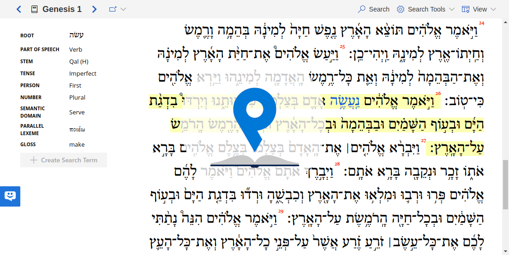
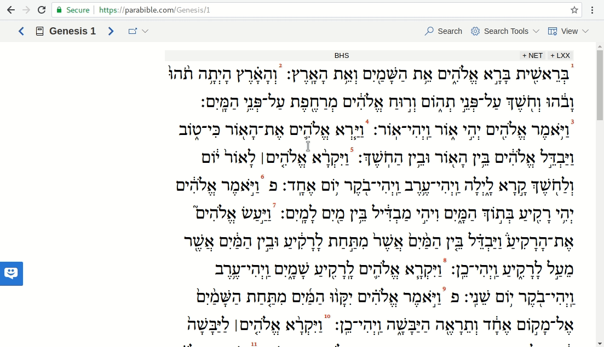

# Parabible Client

[](https://parabible.com/)

## Introduction

This repository is a web client that interfaces with [`parabible-server`](https://github.com/parabible/parabible-server). Here is a sampling of the fantastic things it can do:

- Mobile, Tablet and Desktop media queries for scale the interface for lots of different screen sizes.
- Display various kinds of data: Hebrew, Greek, and English biblical text in parallel, morphological data.
- Build and describes queries visually.
- Show search results and generate a page suitable for export to pdf/printing (complete with highlighted matching words & clauses, courtesy of `parabible-server`).

See the bottom of the readme for a demo gif.

## Contributing

The [`parabible-server`](https://github.com/parabible/parabible-server) API (if I can call it that) is configured with CORS. This means that you should be able to run your own queries against it without being on the [parabible.com](https://parabible.com) domain. So feel free to build a competing interface (how about a dedicated mobile interface :D)!

To get going you’re probably going to want to clone the repository and get the necessary npm modules:

```
git clone https://github.com/parabible/parabible-client.git
npm install
```

To run the client in development mode (with webpack):

```
npm start
```

To build:

```
npm run build
```

Feel free to make Pull Requests that fix [known issues](https://github.com/parabible/parabible-client/issues/) or go ahead and implement new features. I would suggest filing issues before Pull Requests though.


If you want to point your client to your own instance of `parabible-server`, take a look at this line: [`src/util/Xhr.js`](https://github.com/parabible/parabible-client/blob/master/src/util/Xhr.js#L3)

## Tech Stack

- React

- **UI Framework:** Microsoft’s [Office UI Fabric](https://developer.microsoft.com/en-us/fabric#/components)

- **Font:** Subset of [SBL Biblit](https://www.sbl-site.org/educational/BiblicalFonts_SBLBibLit.aspx) (+Microsoft stuff that’s part of Fabric)

- Also, has good intentions of using DonorBox and UserReport to gather user feedback and $$$ (alas, to no avail).

## Demo


